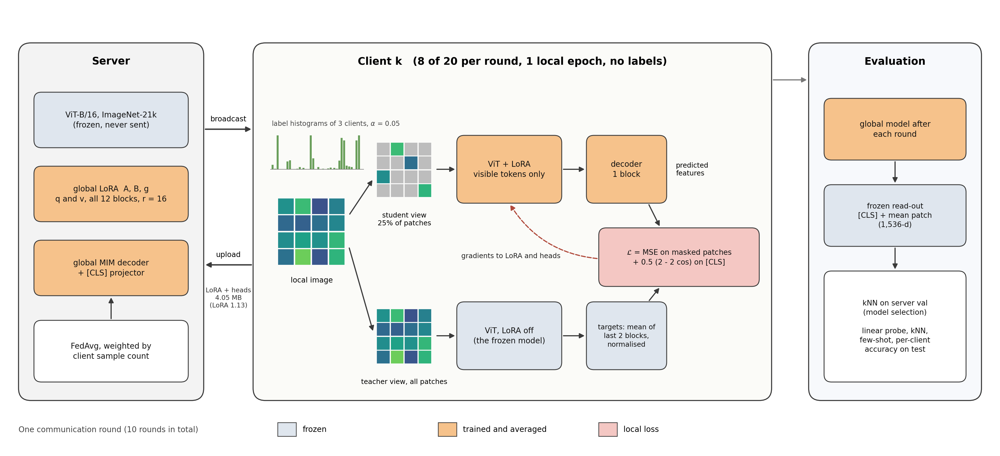
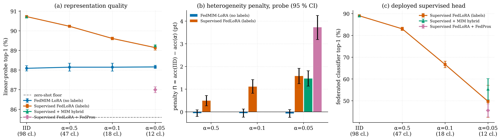
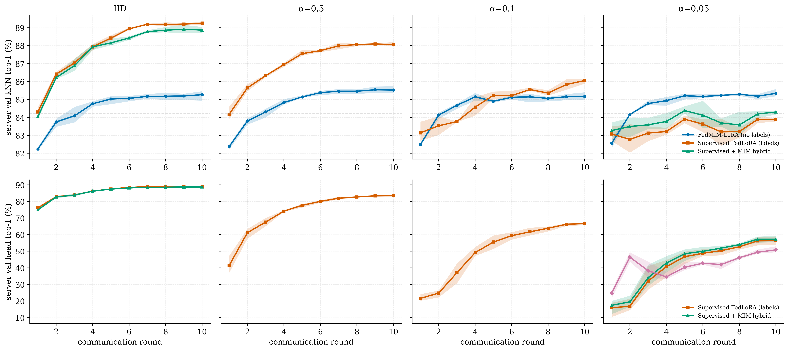
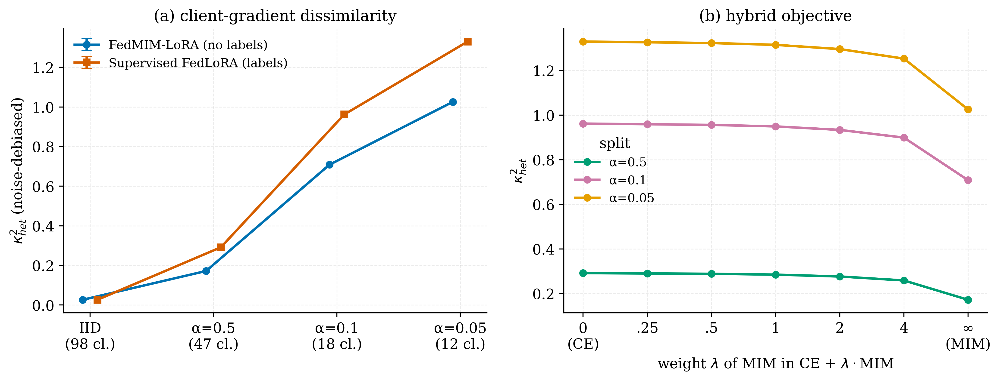
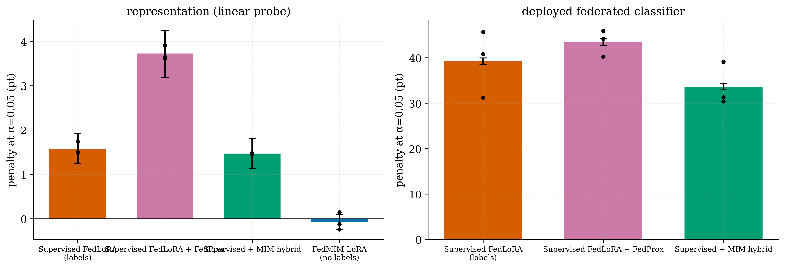

# FedMIM-LoRA

Masked image modeling as the local objective for federated LoRA on a frozen Vision Transformer. With MIM, representation quality stays the same from IID clients down to clients holding about 12 classes each, while supervised federated LoRA on the same partitions loses accuracy and trains less smoothly.



## Summary

20 clients adapt a frozen ViT-B/16 (ImageNet-21k) with LoRA on CIFAR-100. The client data are split with Dirichlet label skew, α ∈ {0.05, 0.1, 0.5}, plus an exact IID split. Each client trains with masked image modeling against feature targets from the frozen backbone. Clients never see labels. Only the LoRA weights and a small decoder are averaged, about 4 MB per client per round. The baseline is supervised federated LoRA on exactly the same partitions, client sampling and budget. Every number below is a mean over 3 seeds, paired by seed.

* MIM linear-probe accuracy moves by −0.07 pt between IID and α = 0.05 (95% CI [−0.24, +0.10]).
* Supervised FedLoRA loses 1.58 pt of probe accuracy over the same range. The difference-in-differences is +1.65 pt (95% CI [1.28, 2.02]) and is positive in all three seeds.
* Fitted over all 24 runs, accuracy changes by −0.07 ± 0.12 pt per decade of effective classes per client for MIM and by +1.67 ± 0.07 for supervised training.
* At α = 0.05, MIM gives back 0.19 pt of validation accuracy between rounds, against 2.13 pt for supervised training.
* Adding MIM to the cross-entropy loss of supervised FedLoRA raises the federated classifier's accuracy by 5.6 pt at α = 0.05.
* Training peaks at 2.1 GB of GPU memory (591 MB in the smallest configuration). Uplink is 4.05 MB per round, 40x less than full fine-tuning; the LoRA weights alone are 1.13 MB (145x less). The whole study ran in one Kaggle session on two T4 GPUs.

## Method

The student is the frozen ViT with LoRA on the query and value projections of all 12 blocks (rank 16). It sees 25% of the image patches. A one-block decoder predicts, at the masked positions, the features that the frozen backbone produces on the full image (mean of the last two blocks, normalised per token). A second term aligns the student [CLS] token with the teacher's through a small projector. The target network is the frozen backbone itself, so the objective cannot collapse and needs no labels.

Each round, 8 of the 20 clients are sampled and train for one local epoch. The server averages LoRA A, B, the LoRA gates, the decoder and the projector, weighted by client sample count. 10 rounds, AdamW, lr 1e-3 with 2 warm-up rounds and cosine decay.

Every model, including the unadapted backbone, is read out the same way: the [CLS] token concatenated with the mean patch token of the last layer. On that read-out we report a linear probe, kNN, a 10% few-shot probe, and per-client accuracy on test subsets that match each client's label distribution. For supervised runs we also report the federated classifier head. Model selection uses kNN on a 5,000-image validation split that no client holds.

## Results

### Accuracy under label skew

CIFAR-100 test top-1 (%), mean ± s.d. over 3 seeds. The unadapted backbone reaches 85.59 (probe) and 84.24 (kNN).

| method | IID | α = 0.5 | α = 0.1 | α = 0.05 |
|---|---|---|---|---|
| FedMIM-LoRA, probe (no labels) | 88.09 ± 0.14 | 88.15 ± 0.20 | 88.15 ± 0.20 | 88.16 ± 0.08 |
| Supervised FedLoRA, probe | 90.72 ± 0.06 | 90.23 ± 0.03 | 89.61 ± 0.07 | 89.14 ± 0.13 |
| Supervised FedLoRA, federated head | 89.00 ± 0.13 | 83.02 ± 0.76 | 66.67 ± 1.50 | 49.75 ± 7.36 |

Heterogeneity penalty, acc(IID) − acc(α), in points (positive means skew hurts). CIs come from a paired test-set bootstrap.

| | α = 0.5 | α = 0.1 | α = 0.05 |
|---|---|---|---|
| FedMIM-LoRA, probe | −0.06 | −0.06 | −0.07 [−0.24, 0.10] |
| Supervised FedLoRA, probe | +0.49 | +1.11 | +1.58 [1.24, 1.92] |
| Difference (supervised − MIM), probe | +0.55 [0.27, 0.83] | +1.17 [0.82, 1.52] | +1.65 [1.28, 2.02] |
| Difference (supervised − MIM), kNN | +0.85 [0.59, 1.11] | +1.94 [1.57, 2.31] | +3.31 [2.89, 3.73] |

Supervised training uses labels on every client and reaches higher absolute accuracy. The point here is sensitivity: the MIM curve is flat, and the supervised curve drops at every step of skew.



### Training dynamics

Per-round validation accuracy (mean over seeds, band = min to max). Under strong skew, supervised training moves up and down between rounds, while MIM rises and levels off.



| α = 0.05 | FedMIM-LoRA | Supervised |
|---|---|---|
| validation kNN given back between rounds | 0.19 pt | 2.13 pt |
| largest drop below the best round so far | 0.15 pt | 1.22 pt |
| rounds where accuracy dropped | 1.0 | 4.0 |

Full numbers are in `results/tables/table7_stability.csv`.

### Client-gradient dissimilarity

Convergence bounds for non-convex FL carry a κ²/T term, where κ² measures how far client gradients are from the global gradient. We measured κ² directly for both objectives at the same parameter point: the pretrained backbone, B = 0, and the same A. Mini-batch noise is subtracted, so an IID split gives κ² ≈ 0 for both objectives, as expected.

| split | κ² MIM | κ² supervised | MIM lower by |
|---|---|---|---|
| α = 0.5 | 0.172 | 0.291 | 41% |
| α = 0.1 | 0.708 | 0.962 | 26% |
| α = 0.05 | 1.026 | 1.330 | 23% |
| IID | 0.027 | 0.027 | (both ≈ 0) |

MIM gradients are less dissimilar at every non-IID split. For the combined loss CE + λ·MIM, κ² falls steadily as λ grows (panel b). This is consistent with the hybrid result below.



### MIM as an auxiliary loss

At α = 0.05, adding MIM to cross-entropy (λ = 1) raises the federated classifier from 49.75% to 55.32%. The gain is +5.6 pt (95% CI [5.2, 6.0]) and is positive in every seed. The probe accuracy stays about the same (89.24 vs 89.14). FedProx (μ = 0.1, not tuned) did not help in this setting (`results/tables/table5_penalties.csv`).



### Cost

Measured on one T4, batch 64:

| configuration | peak memory | throughput | uplink / round |
|---|---|---|---|
| FedMIM-LoRA (mask 0.75, r = 16) | 2.09 GB | 206 img/s | 4.05 MB |
| + gradient checkpointing | 1.16 GB | 181 img/s | 4.05 MB |
| NF4 backbone, mask 0.9, r = 4, batch 16 | 0.58 GB | 83 img/s | 3.20 MB |
| supervised FedLoRA (r = 16) | 4.52 GB | 144 img/s | 1.27 MB |

Full fine-tuning of the backbone would send 163.6 MB per round.

## Reproducing

The whole pipeline is one notebook, `fedmim_lora.ipynb`. `fedmim_lora.py` contains the same code as a plain script.

On Kaggle (this is how the results above were produced): create a notebook from `fedmim_lora.ipynb`, turn on Internet and the GPU T4 x2 accelerator, and run all cells. With `PRESET = "full"` the 33 runs take about 10.7 hours. The notebook costs each run before launching it and stays inside one 12-hour session. Every run is cached, so attaching a previous output as input resumes an interrupted session. `PRESET = "smoke"` runs every code path in about 15 minutes.

Locally:

```bash
git clone https://github.com/<username>/fedmim-lora.git
cd fedmim-lora
pip install -r requirements.txt
python fedmim_lora.py        # writes to ./fedmim_out/fedmim_lora
```

A CUDA GPU is required; with two GPUs, clients are trained on both in parallel. CIFAR-100 is downloaded automatically if it is not found locally. The backbone weights come from the Hugging Face Hub (`google/vit-base-patch16-224-in21k`).

Outputs go to `fedmim_lora/` (under `/kaggle/working` on Kaggle): `metrics/` holds one JSON per run (per-round history, final evaluation, test predictions), `tables/` holds CSV and LaTeX, `figures/` holds PNG and PDF, and `checkpoints/` holds the aggregated tensors of the selected round.

## Repository layout

```
fedmim_lora.ipynb     full pipeline (data, model, federated training, evaluation, analysis, figures)
fedmim_lora.py        same code as a script
assets/pipeline.png   pipeline diagram
results/
  figures/            figures used in this README
  tables/             main results, penalties, difference-in-differences, stability, gradient dissimilarity (CSV)
  base_config.json    shared hyperparameters
```

## Limitations

* One dataset (CIFAR-100), whose classes are close to the ImageNet-21k pretraining data. Label skew is the only kind of heterogeneity tested; feature and domain shift are not.
* 10 communication rounds, one backbone and one LoRA rank.
* The federated classifier head suffers most under skew. Head-calibration methods (e.g. FedBABU, CCVR) are not included as baselines.

## Citation

```bibtex
@misc{biswas2026fedmimlora,
  author       = {Biswas, Anik},
  title        = {{FedMIM-LoRA}: Masked Image Modeling for Federated Low-Rank Adaptation of Vision Transformers under Client Heterogeneity},
  year         = {2026},
  howpublished = {\url{https://github.com/<username>/fedmim-lora}}
}
```

## License

MIT. See `LICENSE`.
