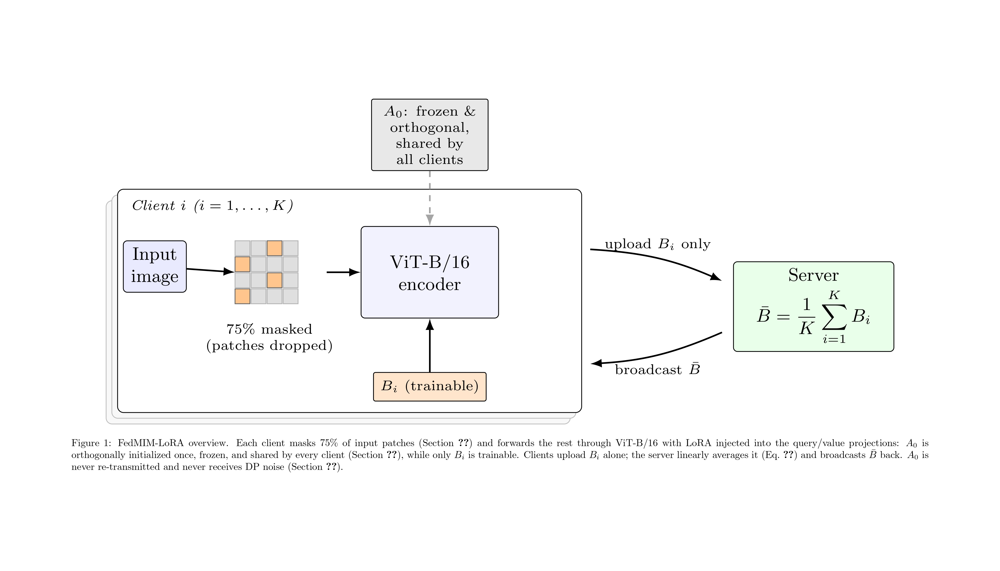

# FedMIM-LoRA


Federated Masked Image Modeling with an Orthogonal Fixed-Down-Projection LoRA strategy. This framework adapts Vision Transformers (ViT) in a federated learning loop by simultaneously addressing communication, memory, and aggregation bottlenecks. 

## Overview: The Three Bottlenecks

Fine-tuning Vision Transformers in a federated setting exposes three major issues that do not occur in centralized training:

*   **Activation Memory Limits:** Self-attention scales quadratically with sequence length. Processing a 224x224 image yields 196 patch tokens, meaning a full ViT-Base fine-tuning pass easily exceeds the 16 GB VRAM limit of typical edge GPUs.
*   **Aggregation Discordance:** Standard LoRA updates are a product of two matrices ($\Delta W = B A$). Because FedAvg averages $A$ and $B$ independently across clients, multiplying the averages together does not equal the average of the local products. This gap acts as directional noise that worsens under non-IID data distributions.
*   **DP Noise Amplification:** Under Differential Privacy (DP-SGD), adding independent noise to both $A$ and $B$ creates a quadratic noise-times-noise cross term during multiplication, which can overwhelm the fine-tuning signal.

## The FedMIM-LoRA Solution

To resolve these constraints without losing model expressivity, this repository implements three combined techniques.

### 1. Exact Linear Aggregation via Fixed-A LoRA
Instead of training both LoRA matrices, FedMIM-LoRA freezes the down-projection matrix $A_0$ and shares it globally across all clients. Only the up-projection matrix $B_i$ is trained and communicated. This collapses the server-side aggregation into an exact linear average:

$$\Delta W_{Fixed-A} = \left(\frac{1}{N}\sum_{i=1}^{N}B_i\right) A_0 = \frac{1}{N}\sum_{i=1}^{N}(B_i A_0) = \Delta W_{Ideal}$$

This eliminates aggregation discordance entirely and removes the quadratic DP noise cross-term because $A_0$ never receives privacy noise. It also halves the communication payload.

### 2. Dynamical Isometry via Orthogonal Initialization
Freezing a random Gaussian matrix can distort the gradient signal reaching $B_i$, which is why vanilla fixed-A methods often underperform. FedMIM-LoRA initializes $A_0$ to have exactly orthonormal rows:

$$A_0 A_0^\top = I_r$$

This guarantees a condition number of 1, meaning the gradient passing through $A_0$ is preserved exactly, neither shrunk nor inflated.

### 3. Memory Reduction via Masked Image Modeling (MIM)
To fix the activation memory bottleneck, the framework applies a 75% masking ratio to the input patches before they reach the encoder.

*   This drops the active sequence length from 196 to 49.
*   The quadratic cost of attention is reduced by roughly 16x.
*   Peak VRAM consumption drops to ~2.2 GB, easily fitting on a 16GB edge-class GPU.

## Repo Structure

```text
fedmim-lora/
├── config.py              # Hyperparameters (r=8, alpha=16, Dirichlet alpha=0.1)
├── train.py               # Federated training entrypoint
├── src/
│   ├── data.py              # CIFAR-100 wrapper, Dirichlet partitioning, MIM collator
│   ├── model.py             # ViT-B/16 + Fixed-A LoRA construction
│   ├── aggregation.py       # Linear server-side B_i averaging
│   ├── client.py            # Local training (AdamW, lr=3e-4, 4 epochs)
│   └── checkpoint.py        # Save/resume helpers
├── requirements.txt
└── LICENSE
